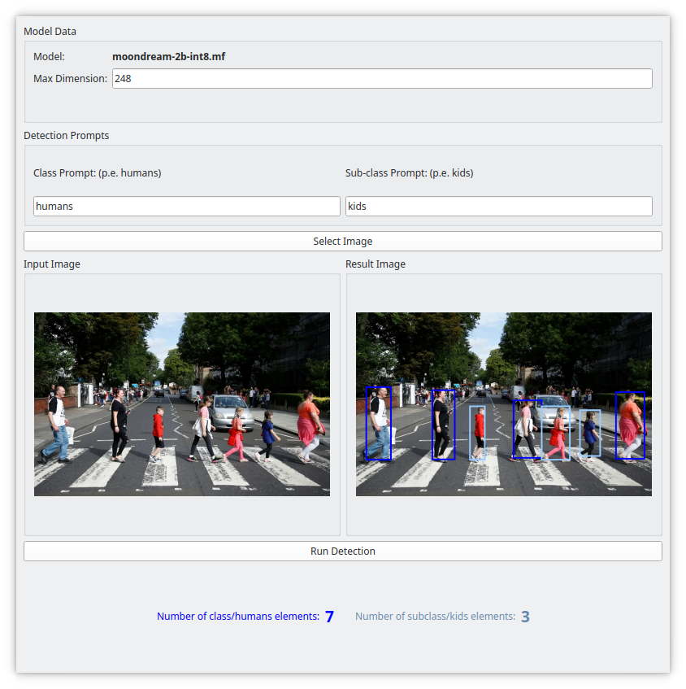
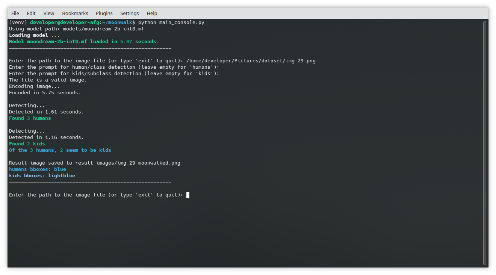
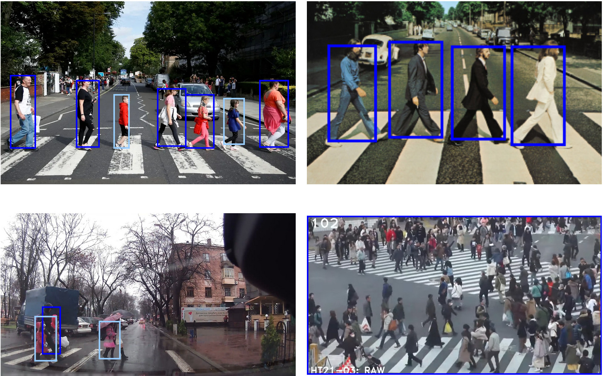

# 🚶 🌔 Moonwalk 🌖 🚶

**Moonwalk** is a small application for testing Moondream models. Its main goal is to detect adults and kids crossing crosswalks. However, since Moondream is a VLM(Vision Language Model), the app can be reconfigured to detect any class-subclass elements (e.g., animal/tiger, fruit/apple).

## Installation

1. Clone the repository:
    ```sh
    git clone https://github.com/AlvaroFerGar/moonwalk.git
    cd moonwalk
    ```
2. Create and activate a virtual environment:
    ```sh
    python -m venv venv
    source venv/bin/activate
    ```
3. Install the required dependencies:
    ```sh
    pip install -r requirements.txt
    ```
4. Download your favourite moondream model and place it on the models folder.
## Option A: GUI Mode
5. Run the application (GUI mode):
    ```sh
    python main.py path/to/my/awesomemodel.mf
    ```
    If you don't specify any path as an argument, it will automatically look for a `moondream-2b-int8.mf` in the `models` folder:
    ```sh
    python main.py 
    ```

6. Use the GUI to select an image, configure detection parameters, and run the detection. After a few seconds, the result will appear on screen.
   
   

   Output images will be saved in the `result_images` folder.

### Option B: Console Mode (avoids PyQt dependencies)
For users who prefer a lightweight option without a graphical user interface, you can run the application in console mode:

5. Use the following command:
    ```sh
    python main_console.py path/to/my/awesomemodel.mf
    ```
   If you don't specify any path as an argument, it will automatically look for a `moondream-2b-int8.mf` in the `models` folder:
    ```sh
    python main_console.py 
    ```
6. Use the console to specify the image path and the prompts you want to use

   

   Output images will be saved in the `result_images` folder.
  
## Project Structure

```
moonwalk/
├── assets/
├── models/
│   ├── download_moondream_to_this_folder.txt
├── newenv/
├── result_images/
│   └── resultimages_will_be_saved_here.txt
├── main.py
├── main_console.py
├── moonkwalkui.py
├── moonwalkcore.py
├── utils.py
├── requirements.txt
└── .gitignore
```

main.py: Entry point of the gui application.

main_console.py: Entry point of the console application.

moonkwalkui.py:Contains the GUI implementation using PyQt5.

moonwalkcore.py: Core logic for loading the model and running detection.

utils.py: Utility functions for detection and image processing.

requirements.txt: List of dependencies required to run the application.


## Mini-Conclusions


Moondream performs well in detecting adults and children on crosswalks when individuals are spaced apart, although the bounding boxes do not always fit perfectly. However, it struggles in crowded scenes or with occlusions. Resizing the image is also recommended for optimal results and to enhance efficiency.

Despite these challenges, its versatility as a VLM allows users to search for any object class, making it adaptable for a wide range of tasks.
